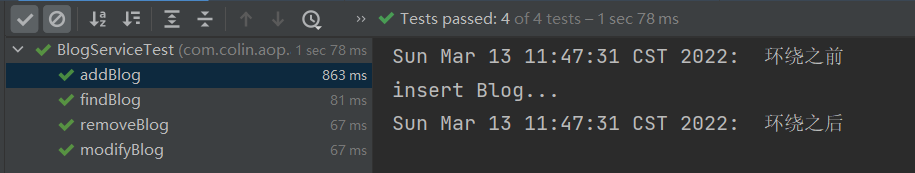
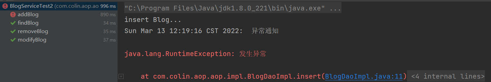

问题引入：参考代理模式http://c.biancheng.net/view/1359.html <br>
在一般应用中，在不修改原有的代码，而在其代码逻辑前后增加一些代码逻辑，而使调用者无感知。<br>
下面介绍两种代理模式：
---
# 一、静态代理
静态代理：由程序员创建代理类或特定工具自动生成源代码再对其编译，
在程序运行前代理类的 .class 文件就已经存在了。

## 步骤：

一、创建抽象主题
```java
package com.colin.aop.proxy;

public interface PersonDao {
    void insertPerson();
}
```
二、创建真实主题
```java
package com.colin.aop.proxy.impl;

import com.colin.aop.proxy.PersonDao;

public class PersonDaoImpl implements PersonDao {
    @Override
    public void insertPerson() {
        System.out.println("insertPerson()");
    }
}

```
三、创建代理类
```java
package com.colin.aop.proxy;

public class StaticProxy implements PersonDao{
    //被代理对象实例
    private PersonDao personDao;
    //事务类对象实例
    private Transaction transaction;

    //这两个对象必须实例化，所以添加构造函数
    public StaticProxy(PersonDao personDao, Transaction transaction) {
        this.personDao = personDao;
        this.transaction = transaction;
    }

    @Override
    public void insertPerson() {
        transaction.openTransaction();
        personDao.insertPerson();
        transaction.comitTransaction();
    }
}
```
四、测试
```java
public class StaticProxyTest {
    @Test
    public void test() {
        //被代理对象应该是提供好的，或者可以通过某种方法获取到的。
        PersonDao personDao = new PersonDaoImpl();
        //事务对象，是我们自己定义的，我们要添加的代码写在这个对象的方法中。
        Transaction transaction = new Transaction();

        //创建一个代理对象
        StaticProxy staticProxy = new StaticProxy(personDao, transaction);
        //调用代理对象的方法
        staticProxy.insertPerson();
    }
}
```


# 二、动态代理
动态代理：在程序运行时，运用反射机制动态创建而成
## JDK的动态代理
一、创建抽象主题
> 同静态代理

二、创建真实主题
> 同静态代理

三、创建代理类
```java
package com.colin.aop.proxy;

import java.lang.reflect.InvocationHandler;
import java.lang.reflect.Method;

public class JDKInterceptor implements InvocationHandler {
    //被代理对象，因为其可以是任一对象，所以是Object类型
    private Object target;
    //事务对象，这个对象由开发者自定义
    private Transaction transaction;

    public JDKInterceptor(Object target, Transaction transaction) {
        this.target = target;
        this.transaction = transaction;
    }

    /**
     * @param proxy 目标对象的代理类实例
     * @param method 对应于在代理类实例上调用接口方法的Method实例（反射的方式调用）
     * @param args 传入代理类实例的方法参数值的对象数组
     * @return 方法的返回值，没有返回值则为null
     */
    @Override
    public Object invoke(Object proxy, Method method, Object[] args) throws Throwable {
        //并不是所有的方法都要切入（例如select操作不需要增加事务），所以在添加事务之前可以进行筛选
        String methodName = method.getName();

        if(methodName.startsWith("delete") ||
        methodName.startsWith("update") ||
        methodName.startsWith("insert")){
            transaction.openTransaction();
            method.invoke(target, args); //相当于被代理类的方法被调用
            transaction.comitTransaction();
        } else {
            method.invoke(target, args);
        }

        return null;
    }
}

```
四、测试
```java
public class JDKInterceptorTest {
    @Test
    public void test(){
        //被代理对象应该是提供好的，或者可以通过某种方法获取到的。
        PersonDao target = new PersonDaoImpl();
        //事务对象，是我们自己定义的，我们要添加的代码写在这个对象的方法中。
        Transaction transaction = new Transaction();

        JDKInterceptor jdkInterceptor = new JDKInterceptor(target, transaction);
        //获取一个代理对象的实例
        PersonDao proxyObject = (PersonDao)Proxy.newProxyInstance(target.getClass().getClassLoader(), target.getClass().getInterfaces(), jdkInterceptor);
        //返回的代理对象必须是接口类，不可以是实现类
        //PersonDaoImpl proxyObject = (PersonDaoImpl) Proxy.newProxyInstance(target.getClass().getClassLoader(), target.getClass().getInterfaces(), jdkInterceptor);
        //使用代理对象来调用被代理对象方法
        proxyObject.selectPerson();
        proxyObject.deletePerson();
        proxyObject.insertPerson();
        proxyObject.updatePerson();
    }
}
```
**注意：**
1. 需要实现`InvocationHandler`接口。
2. JDK方式的动态代理，最后`Proxy.newProxyInstance()`返回的必须是接口类（抽象主题），不能是实现类（真实主题）。

## CGLib的动态代理
一、创建抽象主题
> 同静态代理

二、创建真实主题
> 同静态代理

三、创建代理类
```java
package com.colin.aop.proxy;

import org.springframework.cglib.proxy.Enhancer;
import org.springframework.cglib.proxy.MethodInterceptor;
import org.springframework.cglib.proxy.MethodProxy;

import java.lang.reflect.Method;

public class CGLibInterceptor implements MethodInterceptor {
    //被代理对象，因为其可以是任一对象，所以是Object类型
    Object target;
    //事务对象，这个对象由开发者自定义
    Transaction transaction;

    public CGLibInterceptor(Object target, Transaction transaction) {
        this.target = target;
        this.transaction = transaction;
    }

    //创建代理对象实例
    public Object createProxy(){
        Enhancer enhancer = new Enhancer();
        enhancer.setCallback(this);
        enhancer.setSuperclass(target.getClass());
        return enhancer.create();
    }

    /**
     * @param o 代理对象实例
     * @param method 代理对象实例中调用接口方法的Method实例
     * @param objects 代理对象调用的方法的参数的对象数组
     * @param methodProxy 通过它可以调用父类的方法
     * @return 无返回值则返回null
     */
    @Override
    public Object intercept(Object o, Method method, Object[] objects, MethodProxy methodProxy) throws Throwable {
        //并不是所有的方法都要切入（例如select操作不需要增加事务），所以在添加事务之前可以进行筛选
        String methodName = method.getName();

        if(methodName.startsWith("delete") ||
                methodName.startsWith("update") ||
                methodName.startsWith("insert")){
            transaction.openTransaction();
            method.invoke(target, objects); //相当于被代理类的方法被调用
            transaction.comitTransaction();
        } else {
            method.invoke(target, objects);
        }

        return null;
    }
}
```
四、测试
```java
public class CGLibInterceptorTest {
    @Test
    public void test() {
        //被代理对象应该是提供好的，或者可以通过某种方法获取到的。
        PersonDao target = new PersonDaoImpl();
        //事务对象，是我们自己定义的，我们要添加的代码写在这个对象的方法中。
        Transaction transaction = new Transaction();

        CGLibInterceptor cgLibInterceptor = new CGLibInterceptor(target, transaction);
        //获取代理对象
        PersonDaoImpl proxyObject = (PersonDaoImpl) cgLibInterceptor.createProxy();
        proxyObject.selectPerson();
        proxyObject.deletePerson();
        proxyObject.insertPerson();
        proxyObject.updatePerson();
    }
}
```

**注意：**
1. 需要实现`MethodInterceptor`接口
2. CGLib方式的动态代理通过`createProxy()`（该方法名自定义）返回的的代理对象可以是接口类（抽象主题）也可以是实现类（真实主题）
3. CGLib相对于JDK形式的动态代理，在使用上更加简单，但是要多写一个`createProxy()`方法，在该方法中使用到`Enhancer`类

# 三、AOP相关概念
参考文档：https://blog.csdn.net/bjyfb/article/details/8522849

首先AOP面向切面编程，是一种编程思想，并不是Spring特有的，Spring中的AOP是通过封装代理模式完成。

## AOP中的重要概念:
在看这些概念时，先了解上面的静态代理和动态代理，结合上面的代码例子更容易理解：
1. 切入点（PointCut）：规定了在哪些地方切入，在代码中表现为一个或者多个符合某种规则的方法。（excultion("../")）
2. 切面（Aspect）：可以想象成一个没有具体实现的框架，在程序中，切面是我们要插入的模块，可以理解成一层/一个类/一个应用（Transaction）
3. 通知（Advice）：advice是横向关注点的具体实现者。通知包含在切面中。(openTransaction,comitTransaction)
    - 前置通知：调用目标对象方法之前执行。
    - 后置通知：调用目标对象方法之后执行。
    - 异常通知：目标对象方法出错之后执行。
    - 最终通知：目标对象方法出错或者执行完成之后执行。
    - 环绕通知：目标对象方法执行前后都执行。
4. 连接点（JoinPoint）：指的是要增加通知的方法的方法调用。（deletePerson()的调用）
5. 目标对象（TargetObject）：被一个或多个切面所通知的对象。（PersonDao）
6. 织入（Weaving）：织入就是把切面连接到其它的应用程序类型或者对象上，并创建一个被通知的对象。
7. 引入（Introduction）：在不修改类代码的前提下，为类添加新的方法和属性。
8. AOP代理（AOP Proxy）：AOP框架创建的对象，用来实现切面契约（aspect contract）（包括通知方法执行等功能）。

# 四、AOP的使用
## 引入依赖
Spring的AOP并不是完全体的AOP，所以要引入aspectjrt和aspectjweaver两个jar包。

aspectjrt：https://mvnrepository.com/artifact/aspectj/aspectjrt

aspectjweaver：https://mvnrepository.com/artifact/org.aspectj/aspectjweaver
## 更新模板文件
```xml
<?xml version="1.0" encoding="UTF-8"?>
<beans xmlns="http://www.springframework.org/schema/beans"
    xmlns:xsi="http://www.w3.org/2001/XMLSchema-instance"
    xmlns:context="http://www.springframework.org/schema/context"
    xmlns:aop="http://www.springframework.org/schema/aop"
    xsi:schemaLocation="http://www.springframework.org/schema/beans
        https://www.springframework.org/schema/beans/spring-beans.xsd
        http://www.springframework.org/schema/context
        https://www.springframework.org/schema/context/spring-context.xsd
        http://www.springframework.org/schema/aop 
        https://www.springframework.org/schema/aop/spring-aop.xsd">
        
    
</beans>
```
## aop-xml形式的配置
官方文档：https://docs.spring.io/spring-framework/docs/5.2.19.RELEASE/spring-framework-reference/core.html#aop-schema
### 步骤：
一、创建抽象主题
```java
package com.colin.aop.aop;

public interface BlogDao {
    void insert();
    void delete();
    void update();
    void select();
}
```
二、创建真实主题
```java
package com.colin.aop.aop.impl;

import com.colin.aop.aop.BlogDao;
import org.springframework.stereotype.Repository;

@Repository
public class BlogDaoImpl implements BlogDao {
    @Override
    public void insert() throws RuntimeException {
        System.out.println("insert Blog...");
//        throw new RuntimeException("发生异常");
    }

    @Override
    public void delete() {
        System.out.println("delete Blog...");
    }

    @Override
    public void update() {
        System.out.println("update Blog...");
    }

    @Override
    public void select() {
        System.out.println("select Blog...");
    }
}
```
三、创建工具类Logger（用于模拟日志输入）
```java
package com.colin.aop.aop;

import java.util.Date;

public class Logger {
    public static void info(String message){
        System.out.println(new Date() + ":  " + message);
    }
}
```
四、创建切面类
```java
package com.colin.aop.aop;

import org.springframework.stereotype.Component;

@Component
public class LoggerAspect {
    public void before(){
        Logger.info("前置通知");
    }
    
    public void after(){
        Logger.info("后置通知");
    }
    
    public void throwing(){
        Logger.info("异常通知");
    }
    
    public void returning(){
        Logger.info("最终通知");
    }
    
    public void around(ProceedingJoinPoint pjp) throws Throwable {
        Logger.info("环绕之前");
        //这个方法相当于目标对象中的对应方法的调用。
        pjp.proceed();
        Logger.info("环绕之后");
    }
}
```
五、AOP的xml配置
```xml
<?xml version="1.0" encoding="UTF-8"?>
<beans xmlns="http://www.springframework.org/schema/beans"
       xmlns:xsi="http://www.w3.org/2001/XMLSchema-instance"
       xmlns:context="http://www.springframework.org/schema/context"
       xmlns:aop="http://www.springframework.org/schema/aop"
       xsi:schemaLocation="http://www.springframework.org/schema/beans
        https://www.springframework.org/schema/beans/spring-beans.xsd
        http://www.springframework.org/schema/context
        https://www.springframework.org/schema/context/spring-context.xsd
        http://www.springframework.org/schema/aop 
        https://www.springframework.org/schema/aop/spring-aop.xsd">
    <context:component-scan base-package="com.colin.aop.aop"/>

    <aop:config>
        <aop:aspect ref="loggerAspect">
            <aop:pointcut id="daoPointCut"
                          expression="execution(* com.colin.aop.aop.impl.*DaoImpl.insert*(..)) ||
                         execution(* com.colin.aop.aop.impl.*DaoImpl.delete*(..)) ||
                         execution(* com.colin.aop.aop.impl.*DaoImpl.update*(..))"/>
<!--            <aop:after method="after" pointcut-ref="daoPointCut"/>-->
<!--            <aop:before method="before" pointcut-ref="daoPointCut"/>-->
<!--            <aop:after-throwing method="throwing" pointcut-ref="daoPointCut"/>-->
<!--            <aop:after-returning method="returning" pointcut-ref="daoPointCut"/>-->
            <aop:around method="around" pointcut-ref="daoPointCut"/>
        </aop:aspect>
    </aop:config>

</beans>
```
六、测试
```java
public class BlogServiceTest {
    ApplicationContext ac = new ClassPathXmlApplicationContext("spring-aop.xml");
    BlogService blogService = ac.getBean("blogService", BlogService.class);

    @Test
    public void addBlog() {
        blogService.addBlog();
    }

    @Test
    public void removeBlog() {
        blogService.removeBlog();
    }

    @Test
    public void modifyBlog() {
        blogService.modifyBlog();
    }

    @Test
    public void findBlog() {
        blogService.findBlog();
    }
}
```


**注意：**
1. `<aop:pointcut>`该注解可以复用，所以可以放在`<aop:config>`中任何位置。
2. 环绕通知有之前和之后之分，所以要在通知方法中加入`ProceedingJoinPoint`类型的参数，`proceedingJoinPoint.proceed()`
方法即是连接点。
3. 注解形式AOP配置总结：
   - 配置信息放在 `<aop:config>`标签中
   - 配置的目的就是指定`切面（Aspect）、切入点（PointCut）、通知（Advice）`三个要素，相对应的就是`<aop:aspect>`，`<aop:pointcut>`，`<aop:before>等`三个标签。
   - Aspect通过`ref`与相对应的切面类相关联
   - PointCut通过需要指定一个规则，用于找到切入点，即是`expression`属性
   - Advice需要通过`pointcut-ref`和PointCut连接，并且通过`method`属性指定要添加的代码逻辑所在位置

## 注解形式的aop
官方文档：https://docs.spring.io/spring-framework/docs/5.2.19.RELEASE/spring-framework-reference/core.html#aop-ataspectj

### 步骤：
一、创建抽象主题
> 同xml形式aop

二、创建真实主题
> 同xml形式的aop

三、AOP的注解形式的配置
根据官方文档，有两种配置方式：
1. 在xml文件中添加aop注解扫描
   ```xml
   <!--aop注解扫描-->
   <aop:aspectj-autoproxy/>
   ```
2. 使用配置类进行配置
   ```java
   @Configuration
   @EnableAspectJAutoProxy
   public class AopConfig {
   }
   ```
在本例中使用配置类的形式进行配置：
```java
import org.springframework.context.annotation.ComponentScan;
import org.springframework.context.annotation.Configuration;
import org.springframework.context.annotation.EnableAspectJAutoProxy;

@Configuration
@EnableAspectJAutoProxy
@ComponentScan("com.colin.aop.aop")
public class AopConfig {
}
```

四、切面类中注解的使用
```java
import org.aspectj.lang.ProceedingJoinPoint;
import org.aspectj.lang.annotation.*;
import org.springframework.stereotype.Component;

/**
 * 切面
 */
@Component
@Aspect
public class LoggerAspect {
    @Pointcut("execution(* com.colin.aop.aop.impl.*DaoImpl.insert*(..)) ||" +
            "execution(* com.colin.aop.aop.impl.*DaoImpl.delete*(..)) ||" +
            "execution(* com.colin.aop.aop.impl.*DaoImpl.update*(..))")
    private void daoPointCut() {} // the pointcut signature

//    @Before("daoPointCut()")
    public void before(){
        Logger.info("前置通知");
    }

//    @After("daoPointCut()")
    public void after(){
        Logger.info("后置通知");
    }

    @AfterThrowing("daoPointCut()")
    public void throwing(){
        Logger.info("异常通知");
    }

//    @AfterReturning("daoPointCut()")
    public void returning(){
        Logger.info("最终通知");
    }

//    @Around("daoPointCut()")
    public void around(ProceedingJoinPoint pjp) throws Throwable {
        Logger.info("环绕之前");
        //这个方法相当于目标对象中的对应方法的调用。
        pjp.proceed();
        Logger.info("环绕之后");
    }
}
```
五、测试
```java
public class BlogServiceTest2 {
    ApplicationContext ac = new AnnotationConfigApplicationContext(AopConfig.class);
    BlogService blogService = ac.getBean("blogService", BlogService.class);

    @Test
    public void addBlog() {
        blogService.addBlog();
    }

    @Test
    public void removeBlog() {
        blogService.removeBlog();
    }

    @Test
    public void modifyBlog() {
        blogService.modifyBlog();
    }

    @Test
    public void findBlog() {
        blogService.findBlog();
    }
}
```
发生异常时触发异常通知：



**注意：**
1. 注解形式AOP配置总结：
   - 同样，配置AOP的三个关键点就是配置Aspect、PointCut和Advice
   - Aspect要指定切面类，就在切面类上加@Aspect注解
   - PointCut要指定筛选规则，需要自定义一个方法（方法内容为空），在方法上加@Pointcut注解
   - Advice要指定是什么类型的通知、与其连接的切入点是什么、通知方法的关联，在通知方法上加@Before等注解指定了通知类型和关联方法，
     注解的value="加了@PointCut方法的方法名"与切入点相连接。
2. 也可以省去@PointCut注解的方法，直接@Before(value = "execution()")指定筛选规则。但是这样写起来会很复杂，降低了代码复用性。
3. 环绕通知有之前和之后之分，所以要在通知方法中加入`ProceedingJoinPoint`类型的参数，`proceedingJoinPoint.proceed()`
   方法即是连接点。


**开发时推荐使用xml方式的配置。**

> 面试的时候频繁被问的点：
> 1. aop底层实现：动态代理（jdk动态代理和cglib动态代理咋写，得知道）
> 2. 两种动态代理在使用时如何选取：一种针对于接口，一种针对于实现类。
> 3. aop涉及到的关键名词（切面，切入点，通知...）