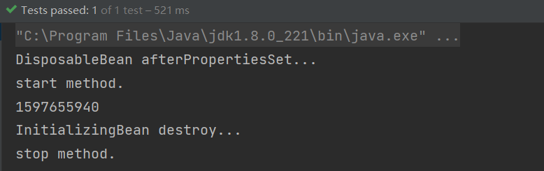
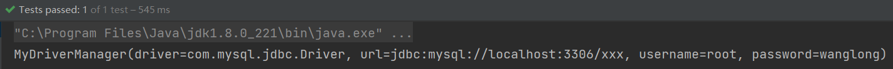

# 一、添加模板文件
在Spring文档中搜索`<beans>`找到配置文件
在任意文件夹上右键->new->Edit File Templates->编辑模板（将Spring官网提供的配置文件模板粘贴过来）->apply

---
# 二、IOC控制反转
创建对象的控制权发生反转，之前需要自己手动new获取对象，现在直接从Spring容器中获取想要的对象。

## 基本使用步骤：
一、引入Spring的依赖
```xml
<dependency>
    <groupId>org.springframework</groupId>
    <artifactId>spring-context</artifactId>
    <version>5.2.12.RELEASE</version>
</dependency>
```
二、创建Spring.xml配置文件（文件名随意）
```xml
<?xml version="1.0" encoding="UTF-8"?>
<beans xmlns="http://www.springframework.org/schema/beans"
       xmlns:xsi="http://www.w3.org/2001/XMLSchema-instance"
       xsi:schemaLocation="http://www.springframework.org/schema/beans
        http://www.springframework.org/schema/beans/spring-beans.xsd">
</beans>
```
三、创建测试bean类（要注入容器中的类）
```java
import lombok.Data;

@Data
public class User {
    private String name;
    private Integer age;
    private String gender;
}
```
四、在配置文件中设置`<bean/>`标签将对象注入到容器中

```xml
<?xml version="1.0" encoding="UTF-8"?>
<beans xmlns="http://www.springframework.org/schema/beans"
       xmlns:xsi="http://www.w3.org/2001/XMLSchema-instance"
       xsi:schemaLocation="http://www.springframework.org/schema/beans
        http://www.springframework.org/schema/beans/spring-beans.xsd">
   <bean id="user" class="com.colin.xml.bean.User"/>
</beans>
```
五、从容器中获取对象
```java
import org.junit.Test;
import org.springframework.context.ApplicationContext;
import org.springframework.context.support.ClassPathXmlApplicationContext;

public class UserTest {
    @Test
    public void test1(){
        ApplicationContext ac = new ClassPathXmlApplicationContext("Spring.xml");
        User user = (User)ac.getBean("user");
        System.out.println(user.toString());
    }
}
```
---
# 三、setter注入
见官方文档core部分1.4.1节Setter-based DI部分：https://docs.spring.io/spring-framework/docs/5.2.19.RELEASE/spring-framework-reference/core.html#beans-setter-injection

## 使用步骤：

一、创建测试Bean类（测试bean类需要有setter方法，例子中使用lombok代替）

```java
import lombok.Data;
import lombok.ToString;

@Setter
@NoArgsConstructor
@ToString
public class User {
   private String name;
   private Integer age;
   private String gender;
}
```
   
二、在配置文件中进行setter注入的配置

```xml
<!--setter注入-->
<bean id="userSetterDI" class="com.colin.xml.bean.User">
   <property name="name" value="张三"/>
   <property name="age" value="18"/>
   <property name="gender" value="男"/>
</bean>
```
三、从容器中获取bean对象
```java
import org.junit.Test;
import org.springframework.context.ApplicationContext;
import org.springframework.context.support.ClassPathXmlApplicationContext;

public class UserTest {
    @Test
    public void testSetterDI(){
        ApplicationContext ac = new ClassPathXmlApplicationContext("Spring.xml");
        User user = ac.getBean("userSetterDI",User.class);
        System.out.println(user);
    }
}
```

**注意：**
1. Bean类必须要要有setter方法
2. Bean类必须要有无参数构造方法，当写带参数的构造方法的时候记得保留无参构造方法，
   防止无参构造方法被覆盖
3. setter方法的命名一定要规范，因为源码中是根据xml文件中的的字段前面加上set来匹配要调用
   的setter方法的，而不是根据字段来匹配。
---
# 四、构造函数注入
见官方文档core部分1.4.1节Constructor-based DI：https://docs.spring.io/spring-framework/docs/5.2.19.RELEASE/spring-framework-reference/core.html#beans-constructor-injection

这也是Spring团队推荐使用的注入方式。

## 使用步骤（三种形式）
一、创建测试bean类
```java
import lombok.*;

@NoArgsConstructor
@AllArgsConstructor
@ToString
public class User {
    private String name;
    private Integer age;
    private String gender;
}
```
二、xml文件配置

```xml
<!--constructor注入-->
<bean id="userConstructor1" class="com.colin.xml.bean.User">
   <constructor-arg index="0" value="李四"/>
   <constructor-arg index="1" value="18"/>
   <constructor-arg index="2" value="女"/>
</bean>

<bean id="userConstructor2" class="com.colin.xml.bean.User">
<constructor-arg type="java.lang.String" value="王五"/>
<constructor-arg type="java.lang.Integer" value="19"/>
<constructor-arg type="java.lang.String" value="男"/>
</bean>

<bean id="userConstructor3" class="com.colin.xml.bean.User">
<constructor-arg name="name" value="时光"/>
<constructor-arg name="age" value="20"/>
<constructor-arg name="gender" value="女"/>
</bean>
```
三、从容器中获取指定的对象
```java
import org.junit.Test;
import org.springframework.context.ApplicationContext;
import org.springframework.context.support.ClassPathXmlApplicationContext;

public class UserTest {
    @Test
    public void testConstructorDI(){
        ApplicationContext ac = new ClassPathXmlApplicationContext("Spring.xml");
        User user1 = ac.getBean("userConstructor1", User.class);
        User user2 = ac.getBean("userConstructor2", User.class);
        User user3 = ac.getBean("userConstructor3", User.class);
        System.out.println(user1.toString());
        System.out.println(user2.toString());
        System.out.println(user3.toString());
    }
}
```
**注意：**
1. Bean类必须要有带参数的构造方法
2. 使用constructor注入时，可以没有无参构造方法，但是为了避免不必要的麻烦，保留无参构造
方法更好。
3. index：根据带参数的构造方法的参数位置注入的，参数位置调换则导致注入结果不同
4. type：首先根据类型进行匹配，当有两个及以上的同类型参数的时候，根据从左到右的顺序注入
5. name：根据参数名进行匹配，一般不会有歧义。
---
# 五、ref
见官方文档core部分1.4.1节Examples of Dependency Injection：https://docs.spring.io/spring-framework/docs/5.2.19.RELEASE/spring-framework-reference/core.html#beans-some-examples

如果一个类中的某个字段要使用容器中另一个对象来填充，此时使用ref关键字来替换value关键字来注入。
## 使用步骤
一、创建Bean类
1. dao层模拟

```java
import com.colin.xml.dao.UserDao;

public class UserDaoImpl implements UserDao {
   @Override
   public void selectUser() {
      System.out.println("dao selectUser");
   }
}
```
2. service层模拟

```java
import com.colin.xml.dao.UserDao;
import com.colin.xml.service.UserService;
import lombok.AllArgsConstructor;
import lombok.NoArgsConstructor;
import lombok.ToString;

@AllArgsConstructor
@NoArgsConstructor
@ToString
public class UserServiceImpl implements UserService {
   private UserDao userDao;

   @Override
   public void selectUser() {
      userDao.selectUser();
   }
}
```
3. servlet模拟

```java
import com.colin.xml.service.UserService;
import lombok.AllArgsConstructor;
import lombok.NoArgsConstructor;
import lombok.ToString;

@AllArgsConstructor
@NoArgsConstructor
@ToString
public class UserServlet {
   private UserService userService;

   protected void doPost() {
      userService.selectUser();
   }
}
```
二、xml文件中使用ref进行配置

```xml
<!--ref的使用-->
<bean id="userDao" class="com.colin.xml.dao.impl.UserDaoImpl"/>

<bean id="userService" class="com.colin.xml.service.impl.UserServiceImpl">
<constructor-arg name="userDao" ref="userDao"/>
</bean>

<bean id="userServlet" class="com.colin.xml.servlet.UserServlet">
<constructor-arg name="userService" ref="userService"/>
</bean>
```
三、测试
```java
import org.junit.Test;
import org.springframework.context.ApplicationContext;
import org.springframework.context.support.ClassPathXmlApplicationContext;

public class UserServletTest {
    ApplicationContext ac = new ClassPathXmlApplicationContext("Spring.xml");
    UserServlet userServlet = ac.getBean("userServlet", UserServlet.class);

    @Test
    public void test(){
        userServlet.doPost();
    }
}
```
---
# 六、beanScope
见官方文档core部分1.5节：https://docs.spring.io/spring-framework/docs/5.2.19.RELEASE/spring-framework-reference/core.html#beans-factory-scopes

Spring对象中的Bean对象默认是单例的，同一个ApplicationContext通过getBean获取对象的时候，
如果id一样，获取到的对象将是同一个对象。

## 修改beanScope为原型模式

```xml

<bean id="beanScope" class="com.colin.xml.bean.User" scope="prototype"/>
```
当`scope`为`prototype`时：同一个ApplicationContext下使用同一个id调用getBean每次获得新的对象

当`scope`为`singleton`时：同一个ApplicationContext下使用同一个id调用getBean获得的对象是同一个

---
# 七、自动注入byType/byName
见官方文档core部分1.4.5节：https://docs.spring.io/spring-framework/docs/5.2.19.RELEASE/spring-framework-reference/core.html#beans-factory-autowire

## 设置默认自动注入方式
一、创建测试Bean类
1. User类
```java
import lombok.*;

@Setter
@NoArgsConstructor
@AllArgsConstructor
@ToString
public class User {
    private String name;
    private Integer age;
    private String gender;

    public void sayHello(){
        System.out.println("hello");
    }
}
```
2. Blog类
```java
import lombok.*;

@AllArgsConstructor
@NoArgsConstructor
@ToString
@Setter
public class Blog {
    private Integer id;
    private User author;

    public void sayHello(){
        author.sayHello();
    }
}
```
二、配置默认自动注入的方式

```xml
<?xml version="1.0" encoding="UTF-8"?>
<beans xmlns="http://www.springframework.org/schema/beans"
       xmlns:xsi="http://www.w3.org/2001/XMLSchema-instance"
       xsi:schemaLocation="http://www.springframework.org/schema/beans
        http://www.springframework.org/schema/beans/spring-beans.xsd"
       default-autowire="byName">
   <bean id="author" class="com.colin.xml.bean.User"/>
   <bean id="blog" class="com.colin.xml.bean.Blog"/>

</beans>
```
三、测试
如果自动注入成功，则调用blog.sayHello()时就不会报空指针异常，如果没有自动注入成功，则会报空指针异常的错误
```java
import org.junit.Test;
import org.springframework.context.ApplicationContext;
import org.springframework.context.support.ClassPathXmlApplicationContext;

public class AutoWiredTest {
    @Test
    public void test(){
        ApplicationContext ac = new ClassPathXmlApplicationContext("Autowired.xml");
        Blog blog = ac.getBean("blog", Blog.class);
        blog.sayHello();
    }
}
```
**注意：**
1. byName：Blog对象中的User类型的字段的命名（例子中为author）必须和xml文件中的beanId命名（例子中的author）相同，
   此时会自动根据命名的方式去容器中找相应的bean对象来注入。
2. byType：使用此种注入方式时，容器中这一种类型的对象（例子中的User类型的对象）只能有一个，才能确保注入成功，
   否则无法得知将容器中哪一个User对象注入给Blog对象。
3. 使用自动注入的时候，需要注入其他对象的对象（例子中的Blog）必须要有setter方法，才可以被注入成功。
---
# 八、生命周期

## 在getBean之前/之后进行操作
### 第一种 在`<bean>`标签中进行配置
1. 定义方法
```java
public class LifeCycle {
    private void start(){
        System.out.println("start method.");
    }

    private void stop(){
        System.out.println("stop method.");
    }
}
```
2. 在`<bean>`标签中进行配置

```xml
<?xml version="1.0" encoding="UTF-8"?>
<beans xmlns="http://www.springframework.org/schema/beans"
       xmlns:xsi="http://www.w3.org/2001/XMLSchema-instance"
       xsi:schemaLocation="http://www.springframework.org/schema/beans http://www.springframework.org/schema/beans/spring-beans.xsd">
   <bean id="lifecycle" class="com.colin.xml.lifecycle.LifeCycle" init-method="start" destroy-method="stop"/>
</beans>
```
3. 调用`ClassPathXmlApplicationContext.start`和
   `ClassPathXmlApplicationContext.destroy`测试
```java
import org.junit.After;
import org.junit.Before;
import org.junit.Test;
import org.springframework.context.support.ClassPathXmlApplicationContext;

public class LifeCycleTest {
    ClassPathXmlApplicationContext ac = new ClassPathXmlApplicationContext("LifeCycle.xml");

    @Before
    public void setUp(){
        ac.start();
    }

    @After
    public void tearDown(){
        ac.close();
    }

    @Test
    public void test(){
        LifeCycle lifeCycle = ac.getBean("lifecycle", LifeCycle.class);
        System.out.println(lifeCycle.hashCode());
    }
}
```

### 第二种 在`<beans>`标签中进行配置
1. 定义方法
```java
public class LifeCycle {
    private void startMethod(){
        System.out.println("beans start...");
    }

    private void destroyMethod(){
        System.out.println("beans destroy...");
    }
}
```
2. 在`<beans>`标签中进行配置

```xml
<?xml version="1.0" encoding="UTF-8"?>
<beans xmlns="http://www.springframework.org/schema/beans"
       xmlns:xsi="http://www.w3.org/2001/XMLSchema-instance"
       xsi:schemaLocation="http://www.springframework.org/schema/beans 
       http://www.springframework.org/schema/beans/spring-beans.xsd"
       default-init-method="startMethod" default-destroy-method="destroyMethod">

   <bean id="lifecycle" class="com.colin.xml.lifecycle.LifeCycle"/>
</beans>
```
3. 测试（同上）

### 第三种 实现`InitializingBean`和`DisposableBean`接口
1. 指定类实现`InitializingBean`和`DisposableBean`接口并重写接口方法
```java
import org.springframework.beans.factory.DisposableBean;
import org.springframework.beans.factory.InitializingBean;

public class LifeCycle implements InitializingBean, DisposableBean {
    @Override
    public void destroy() throws Exception {
        System.out.println("InitializingBean destroy...");
    }

    @Override
    public void afterPropertiesSet() throws Exception {
        System.out.println("DisposableBean afterPropertiesSet...");
    }
}
```
2. 测试（同上）
   
**注意：**
1. `<bean>`标签中的`init-method`和`destroy-method`属性`=`后面只有方法名没有`()`
2. 在`<beans>`标签中做的配置是默认配置，即其下的所有`<bean>`标签
如果没有进行单独配置的话会遵循该配置
3. `destroy()`方法被弃用，使用`close()`方法测试
4. 在测试方法中不能使用`ApplicationContext`，而要使用`ClassPathXmlApplicationContext`定义`BeanFactory`
因为ApplicationContext接口中没有定义`start()`和`destroy()`方法
   
### 三种实现方法的优先级问题
毋庸置疑的是，第一种和第二种一定是**局部配置优先于全局配置**，重点是第三种实现方式的优先级，
将所有的配置全都写进代码中，测试结果如下:



即：第三种实现接口的方式会在第一种局部配置的方式之前执行，但是第一种方式也会执行，
第一种配置覆盖了第二种配置。

# 九、读取配置文件

**步骤：**

一、准备配置文件
```properties
jdbc.driver=com.mysql.jdbc.Driver
jdbc.url=jdbc:mysql://localhost:3306/xxx
jdbc.username=root
jdbc.password=wanglong
```
二、读取配置文件（property-placeholder）
```xml
<context:property-placeholder location="classpath:jdbc.properties"/>
```
三、使用配置文件中的`K-V对`
```xml
<bean id="driverXml" class="com.colin.xml.driver.DriverXml">
   <constructor-arg index="0" value="${jdbc.driver}"/>
   <constructor-arg index="1" value="${jdbc.url}"/>
   <constructor-arg index="2" value="${jdbc.username}"/>
   <constructor-arg index="3" value="${jdbc.password}"/>
</bean>
```
四、测试
```java
import org.junit.Test;
import org.springframework.context.ApplicationContext;
import org.springframework.context.support.ClassPathXmlApplicationContext;

public class DriverXmlTest {
   ApplicationContext ac = new ClassPathXmlApplicationContext("driver-xml.xml");

   @Test
   public void test(){
      DriverXml driverXml = ac.getBean("driverXml", DriverXml.class);
      System.out.println(driverXml);
   }
}
```


**注意：**
1. classpath:是源文件根目录。（src/resources） 
2. 加k-v键值对常量的时候，一定要加xxx.xxx（例如jdbc.username），否则直接使用username，则默认读取的是电脑的系统环境变量中的username
