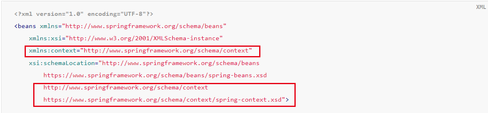

# 一、添加模板文件
官方文档：https://docs.spring.io/spring-framework/docs/5.2.19.RELEASE/spring-framework-reference/core.html#beans-annotation-config
在官方文档中找到配置文件模板，然后替换原来配置文件模板的内容。

**注意:**
1. 新的模板相较于原来的模板增加了一些内容：

   
# 二、添加组件扫描器
```xml
<?xml version="1.0" encoding="UTF-8"?>
<beans xmlns="http://www.springframework.org/schema/beans"
       xmlns:xsi="http://www.w3.org/2001/XMLSchema-instance"
       xmlns:context="http://www.springframework.org/schema/context"
       xsi:schemaLocation="http://www.springframework.org/schema/beans http://www.springframework.org/schema/beans/spring-beans.xsd http://www.springframework.org/schema/context https://www.springframework.org/schema/context/spring-context.xsd">
    
    <!--添加组件扫描器-->
    <context:component-scan base-package="com.colin.annotation"/>
</beans>
```

# 三、常见注解
## 1. @Component
### 使用步骤:
1. 添加组件扫描器
2. 添加@Component注解
```java
import org.springframework.stereotype.Component;

@Component
public class MyComponet {
    public void method(){
        System.out.println("MyComponet...");
    }
}
```
3. 测试调用
```java
public class MyComponetTest {
   ApplicationContext ac = new ClassPathXmlApplicationContext("Annotation.xml");
   MyComponet myComponet = ac.getBean("myComponet", MyComponet.class);

   @Test
   public void test(){
      myComponet.method();
   }
}
  
```

**注意：**
1. 回顾之前的xml形式的`<bean>`标签中最基本的两个是`id`和`class`，使用注解时
   这里的id默认就是该类的类名（首字母小写），如果要修改id的值，可以通过给定`@Componet`
   注解的value参数。
   ```java
   @Component("abc")
   public class MyComponet {
   public void method(){
   System.out.println("MyComponet...");
   }
   }
   ```
2. 该注解只能放在类上。
## 2. @Service
和@Componet一样，专用于服务层（*Service）
## 3. @Controller
和@Componet一样，专用于控制层（*Controller *Servlet）
## 4. @Repository
和@Componet一样，专用于持久层（*Dao *Mapper）
### 使用：
一、加入组件扫描器
二、Dao层模拟
```java
import com.colin.annotation.dao.UserDao;
import org.springframework.stereotype.Repository;

@Repository
public class UserDaoImpl implements UserDao {
   @Override
   public void selectUserById() {
      System.out.println("select user by id....");
   }
}
```
三、Service层模拟
```java
import com.colin.annotation.dao.UserDao;
import com.colin.annotation.service.UserService;
import org.springframework.beans.factory.annotation.Autowired;
import org.springframework.stereotype.Service;

@Service
public class UserServiceImpl implements UserService {
    @Autowired
    UserDao userDao;

    @Override
    public void selectUserById() {
        userDao.selectUserById();
    }
}
```
四、Controller层模拟
```java
import com.colin.annotation.service.UserService;
import org.springframework.beans.factory.annotation.Autowired;
import org.springframework.stereotype.Controller;

@Controller
public class UserController {
    @Autowired
    UserService userService;

    void login(){
        userService.selectUserById();
    }
}
```
四、调用测试
```java
public class UserControllerTest {
    ApplicationContext ac = new ClassPathXmlApplicationContext("annotation.xml");
    UserController userController = ac.getBean("userController", UserController.class);
   
    @Test
    public void login() {
        userController.login();
    }
}
```
**注意：** 
1. 上面这几个注解都放到实现类上，而不要放到其对应的接口上

## 4. @Autowired注解，（注解形式的DI）
使用方法如上例所示。

**注意：**
1. 如果类A注入给类B，必须保证容器中有类A类型的变量
2. 该注解可以放在哪些位置？
   - 构造函数 构造注入
     ```java
      @Service
      public class MyService {
      MyComponet myComponet;
      
          @Autowired
          public MyService(MyComponet myComponet) {
              this.myComponet = myComponet;
          }
      
          public MyService() {
      
          }
      }
      ```
   - 方法  放在set方法上是实现的set注入（官网推荐）
     ```java
      @Service
      public class MyService {
      MyComponet myComponet;
      
          @Autowired
          public void setMyComponet(MyComponet myComponet) {
              this.myComponet = myComponet;
          }
      }
      ```
   - 参数  自动注入（默认byType自动注入）
        ```java
        @Service
        public class MyService {
        @Autowired
        MyComponet myComponet;
        }
        ```


