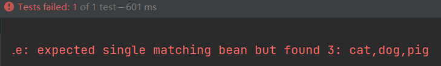

# 一、添加模板文件
官方文档：https://docs.spring.io/spring-framework/docs/5.2.19.RELEASE/spring-framework-reference/core.html#beans-annotation-config
在官方文档中找到配置文件模板，然后替换原来配置文件模板的内容。

**注意:**
1. 新的模板相较于原来的模板增加了一些内容：

   
# 二、添加组件扫描器
```xml
<?xml version="1.0" encoding="UTF-8"?>
<beans xmlns="http://www.springframework.org/schema/beans"
       xmlns:xsi="http://www.w3.org/2001/XMLSchema-instance"
       xmlns:context="http://www.springframework.org/schema/context"
       xsi:schemaLocation="http://www.springframework.org/schema/beans http://www.springframework.org/schema/beans/spring-beans.xsd http://www.springframework.org/schema/context https://www.springframework.org/schema/context/spring-context.xsd">
    
    <!--添加组件扫描器-->
    <context:component-scan base-package="com.colin.annotation"/>
</beans>
```

# 三、常见注解
## 1. @Component
### 使用步骤:
1. 添加组件扫描器
2. 添加@Component注解
```java
import org.springframework.stereotype.Component;

@Component
public class MyComponet {
    public void method(){
        System.out.println("MyComponet...");
    }
}
```
3. 测试调用
```java
public class MyComponetTest {
   ApplicationContext ac = new ClassPathXmlApplicationContext("Annotation.xml");
   MyComponet myComponet = ac.getBean("myComponet", MyComponet.class);

   @Test
   public void test(){
      myComponet.method();
   }
}
  
```

**注意：**
1. 回顾之前的xml形式的`<bean>`标签中最基本的两个是`id`和`class`，使用注解时
   这里的id默认就是该类的类名（首字母小写），如果要修改id的值，可以通过给定`@Componet`
   注解的value参数。
   ```java
   @Component("abc")
   public class MyComponet {
   public void method(){
   System.out.println("MyComponet...");
   }
   }
   ```
2. 该注解只能放在类上。
## 2. @Service
和@Componet一样，专用于服务层（*Service）
## 3. @Controller
和@Componet一样，专用于控制层（*Controller *Servlet）
## 4. @Repository
和@Componet一样，专用于持久层（*Dao *Mapper）
### 使用：
一、加入组件扫描器
二、Dao层模拟
```java
import com.colin.annotation.dao.UserDao;
import org.springframework.stereotype.Repository;

@Repository
public class UserDaoImpl implements UserDao {
   @Override
   public void selectUserById() {
      System.out.println("select user by id....");
   }
}
```
三、Service层模拟
```java
import com.colin.annotation.dao.UserDao;
import com.colin.annotation.service.UserService;
import org.springframework.beans.factory.annotation.Autowired;
import org.springframework.stereotype.Service;

@Service
public class UserServiceImpl implements UserService {
    @Autowired
    UserDao userDao;

    @Override
    public void selectUserById() {
        userDao.selectUserById();
    }
}
```
四、Controller层模拟
```java
import com.colin.annotation.service.UserService;
import org.springframework.beans.factory.annotation.Autowired;
import org.springframework.stereotype.Controller;

@Controller
public class UserController {
    @Autowired
    UserService userService;

    void login(){
        userService.selectUserById();
    }
}
```
四、调用测试
```java
public class UserControllerTest {
    ApplicationContext ac = new ClassPathXmlApplicationContext("annotation.xml");
    UserController userController = ac.getBean("userController", UserController.class);
   
    @Test
    public void login() {
        userController.login();
    }
}
```
**注意：** 
1. 上面这几个注解都放到实现类上，而不要放到其对应的接口上

## 4. @Autowired注解，（注解形式的DI）
使用方法如上例所示。

### 一、@Qualifier
我们知道@Autowired默认是按照byType的方式进行自动装配的，如果通过byType找到多个实现类时，此时系统就不知道
该使用哪一个实现类进行注入，此时会抛出异常（如果不想抛出异常可以设置`@Autowired(required=false)`，required默认时true表示一定要找到注入类）<br>
此时使用@Qualifier能够很好的解决这一问题：<br>
```java
@Service
public class ResourceService {
    @Qualifier("pig")
    @Autowired
    Animal animal;

    public void method(){
        animal.speak();
        animal.run();
    }
}
```
以上代码指定了当`Animal`类有三个实现类可以注入时，使用`Dog`进行注入。

**注意：**
1. @Qualifier的参数value应该传入Bean的名字。
2. 如果类A注入给类B，必须保证容器中有类A类型的变量
3. 该注解可以放在哪些位置？
   - 构造函数 构造注入
     ```java
      @Service
      public class MyService {
      MyComponet myComponet;
      
          @Autowired
          public MyService(MyComponet myComponet) {
              this.myComponet = myComponet;
          }
      
          public MyService() {
      
          }
      }
      ```
   - 方法  放在set方法上是实现的set注入（官网推荐）
     ```java
      @Service
      public class MyService {
      MyComponet myComponet;
      
          @Autowired
          public void setMyComponet(MyComponet myComponet) {
              this.myComponet = myComponet;
          }
      }
      ```
   - 参数  自动注入（默认byType自动注入）
        ```java
        @Service
        public class MyService {
        @Autowired
        MyComponet myComponet;
        }
        ```

### 二、集合中泛型的自动注入
当要被注入的对象是一个集合：

```java
import com.colin.annotation.bean.Animal;
import org.springframework.beans.factory.annotation.Autowired;
import org.springframework.stereotype.Service;

import java.util.List;

@Service
public class CollectionService {
   @Autowired
   List<Animal> animalList;

   public void method() {
      if (animalList == null) {
         System.out.println("no annimal");
      } else {
         for (Animal animal : animalList) {
            animal.speak();
         }
      }
   }
}
```
传统`new对象`的方法去调用`method()`方法：
```java
@Test
public void method2(){
  CollectionService cs = new CollectionService();
  cs.method();
}
```


使用DI的方式调用`method()`方法：
```java
public class CollectionServiceTest {

   ApplicationContext ac = new ClassPathXmlApplicationContext("annotation.xml");

   @Test
   public void method() {
      CollectionService cs = ac.getBean("collectionService", CollectionService.class);
      cs.method();
   }
}
```


如果想要规定注入的顺序，则可以使用`@Order`注解

### 三、 @Order注解
@Order注解是一个用于排序的辅助注解。

如果要实现上面的要求，按照顺序注入，则可以将其加在实现类（例中的Cat、Dog、Pig类）的上面。<br>
他的value值表示的是**排序的依据**，即当有多个满足条件的对象可以注入的时候，按照@Order的value
值从**小到大依次注入**，**value值默认为2147483647**
```java
@Order(3)
@Component
public class Cat implements Animal {
    @Override
    public void speak() {
        System.out.println("喵喵喵...");
    }

    @Override
    public void run() {
        System.out.println("猫步");
    }
}
```
同上，给`Dog`类加注解`@Order(2)`<br>
同上，给`Pig`类加注解`@Order(1)`

重新执行测试类:


结果按照 Pig->Dog->Cat 的顺序注入。

**注意：**
1. @Order的这种使用方法用的不多，但是可以了解一下。
2. @Order可以放在`类、普通方法、字段`上。
2. @Order对于无序的集合使用无意义。（提醒：iter遍历无序的集合是根据hashcode执行的）

## 5. @Resource
参考文档：https://blog.csdn.net/weixin_40423597/article/details/80643990
### 一、@Resource
@Resource的作用相当于@Autowired，只不过@Autowired按byType自动注入，而@Resource默认按 byName自动注入罢了。<br>
@Resource有两个属性是比较重要的，分是name和type，Spring将@Resource注解的name属性解析为bean的名字，而type属性则解析为bean的类型。<br>
所以如果使用name属性，则使用byName的自动注入策略，而使用type属性时则使用byType自动注入策略。<br>
如果既不指定name也不指定type属性，这时将通过反射机制使用byName自动注入策略。<br>

### 二、@Resource装配顺序：
#### 测试过程：
1. 创建实验Bean类
```java
public interface Animal {
    void speak();
    void run();
}
```
```java
@Component
public class Pig implements Animal {
    @Override
    public void speak() {
        System.out.println("哼哼哼");
    }

    @Override
    public void run() {
        System.out.println("猪突猛进");
    }
}
```
```java
@Component
public class Dog implements Animal {
    @Override
    public void speak() {
        System.out.println("汪汪汪");
    }

    @Override
    public void run() {
        System.out.println("我是修勾，我在修沟");
    }
}
```
2. 在ResourceService类中使用@Resource注解
```java
import com.colin.annotation.bean.Animal;
import com.colin.annotation.bean.impl.Dog;
import org.springframework.stereotype.Service;
import javax.annotation.Resource;

@Service
public class ResourceService {
    @Resource(name = "dog", type = Dog.class)
    Animal animal;

    public void method(){
        animal.speak();
        animal.run();
    }
}
```
3. 测试类执行
```java
import org.junit.Test;
import org.springframework.context.ApplicationContext;
import org.springframework.context.support.ClassPathXmlApplicationContext;

public class ResourceServiceTest {
    ApplicationContext ac = new ClassPathXmlApplicationContext("annotation.xml");
    
    @Test
    public void method() {
        ResourceService rs = ac.getBean("resourceService", ResourceService.class);
        rs.method();
    }
}
```
#### @Resource装配顺序
1. 如果同时指定了name和type，则从Spring上下文中找到唯一匹配的bean进行装配，找不到则抛出异常
   
   | `@Resource(name = "dog", type = Dog.class)` | `@Resource(name = "pig", type = Dog.class)` |
   | :--------: | :---------: |
   |||
2. 如果指定了name，则从上下文中查找名称（id）匹配的bean进行装配，找不到则抛出异常
   
   | `@Resource(name = "pig")` | `@Resource(name = "cow")` |
   | :--------: | :---------: |
   |||
3. 如果指定了type，则从上下文中找到类型匹配的唯一bean进行装配，找不到或者找到多个，都会抛出异常
   
   | `@Resource(type = Dog.class)` | `@Resource(type = Animal.class)` |
   | :--------: | :---------: |
   ||`NoUniqueBeanDefinitionException`<br>|
4. 如果既没有指定name，又没有指定type，则自动按照byName方式进行装配；如果没有匹配，则回退为一个原始类型进行匹配，如果匹配则自动装配；
   
   |  |  |
   | :--------: | :---------: |
   |||

### 三、@Resource能放在哪些位置？
可以放在字段、普通方法、类上，不可以放在构造函数上。

### 四、@Resource和@Autowired区别：
1. @Autowired是Spring中的注解，而@Resource是jdk中的注解。
2. @Autowired默认是byType，@Resource默认是byName
3. @Autowired可以放在`CONSTRUCTOR、METHOD、PARAMETER、FIELD、ANNOTATION_TYPE`，而@Resource能放在`TYPE、FIELD、METHOD`

## 5. @Scope注解，设置beanScope
在xml方式注入的时候，我们可以通过`<bean>`标签中的`scope`属性来设置该对象是单例模式还是原型模式。
当使用注解配置的时候，要实现这一目的，可以通过`@Scope`这一注解来实现
```java
@Scope("prototype")
@Service
public class ScopeService {
}
```
当@Scope的value = "prototype"：原型模式

当@Scope的value = "singleton"：单例模式

**注意：**
1. 这里的原型模式和单例模式的前提是必须是同一个ApplicationContext


